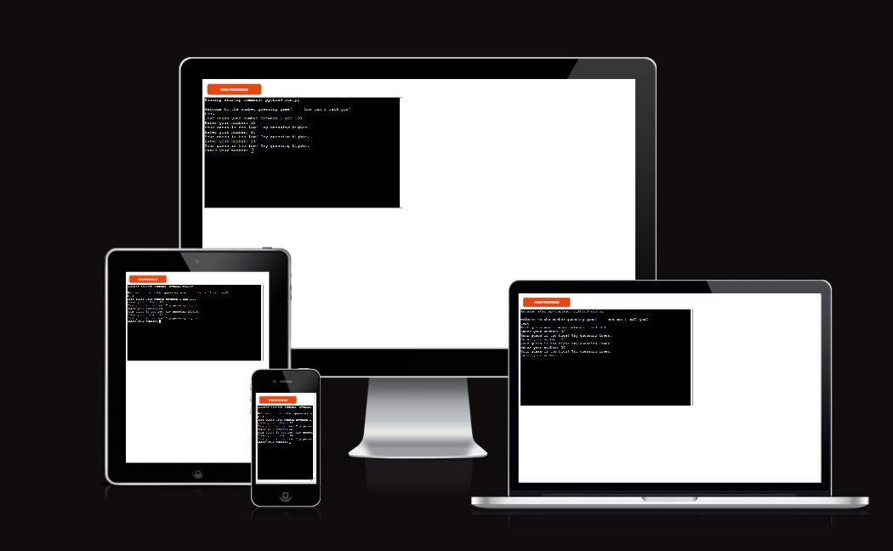
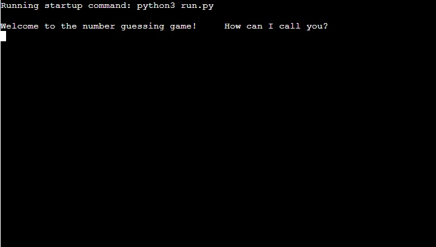
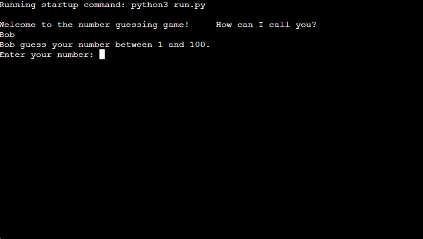
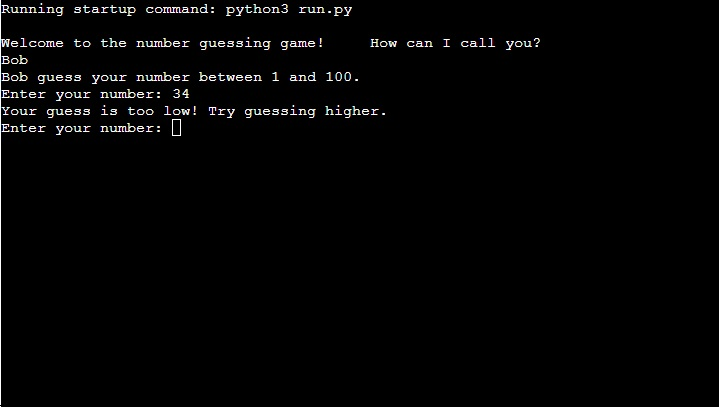

# Number Guessing game
Number Guessing game is a Python terminal program that runs in the Code Institute Heroku terminal.

It is the third portfolio project for the Code Institute course I have made.
A classic game of number-guessing, where the user picks their username, picks a number, and the computer tells them if they guessed it correctly, or they need to try again with a lower or higher number. 

[Number Guessing game](https://ppt3-number-guessing-game-300af078661f.herokuapp.com/)

## Owner Goals

As the Owner, my goal was to create a classic, not too difficult game that can be enjoyed by everyone, and mostly anytime and anywhere, whether to pass time waiting for something, or if one is simply bored.
I wanted the users to not have any need to too deeply immerse themselves in the game, instead be able to jump in anytime for a quick round or two.

## Features 
### How to Use

When the program runs, the user is asked to input their username. This can only contain letters.

Once the user has given their name, the app tells them to pick a number between 1-100.
If the given number is anything else than a whole number between 1 and 100, the game will give an error code asking the player to pick a proper number.

After choosing the number, the game tells the user if their guess was correct, too high, or too low. In case of the latter two, it will tell the user to Try again with a higher or lower number.

