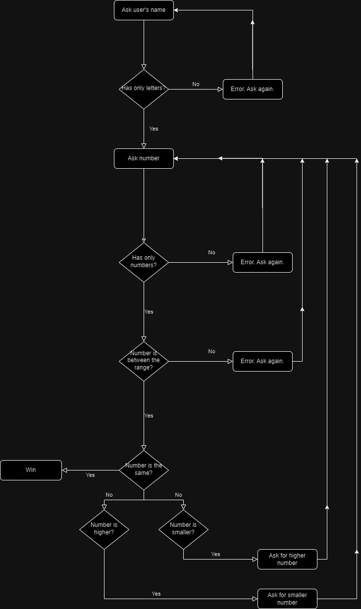
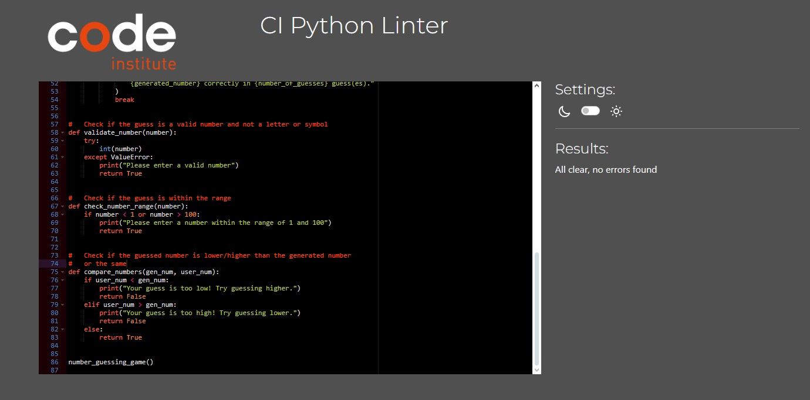

# Number Guessing game
Number Guessing game is a Python terminal program that runs in the Code Institute Heroku terminal.

It is the third portfolio project for the Code Institute course I have made.
A classic game of number-guessing, where the user picks their username, picks a number, and the computer tells them if they guessed it correctly, or they need to try again with a lower or higher number. 

[Number Guessing game](https://ppt3-number-guessing-game-300af078661f.herokuapp.com/)

## Owner Goals

As the Owner, my goal was to create a classic, not too difficult game that can be enjoyed by everyone, and mostly anytime and anywhere, whether to pass time waiting for something, or if one is simply bored.
I wanted the users to not have any need to too deeply immerse themselves in the game, instead be able to jump in anytime for a quick round or two.

## Features 
### How to Use

When the program runs, the user is asked to input their username. This can only contain letters.

Once the user has given their name, the app tells them to pick a number between 1-100.
If the given number is anything else than a whole number between 1 and 100, the game will give an error code asking the player to pick a proper number.

After choosing the number, the game tells the user if their guess was correct, too high, or too low. In case of the latter two, it will tell the user to Try again with a higher or lower number.

### Logic

I made this flowchart of the logic and structure of the program I wanted to create. As this is a classic game, the logical progress was partially predetermined so the program would work.

### Existing Features
#### Interface and Interaction
- The interface is simple and uncomplicated, making the minigame easy-to-understand to the user. First it asks for the name, then the guessed number, then by each guess gives a feedback whether the guessed number is correct, too high, or too low.

#### Match Result Entry 
- Once the number has been correctly guessed, the program congratulates the user and tells them how many tries it took to win the game. After that, the user can immediately play a new round.

#### Input Validation

The program contains checks to make sure that the data entered is correct. If it is incorrect, the user will be prompted to re-enter the data.

### Future Features 

- Save function to keep track how many tries each round took.

- Some "personalization", like colored text, to make it visually more appealing

- An image background, so that once the program is running, it won't be a blank white background, instead something more appealing, with the rules also present there.

## Testing

I have manual tested the program by running it the whole way through. Everything works as intended. Friends and family have also been asked to test, and encountered no problems.

### Bugs
#### Solved Bugs

- Due to exceeding 79 characters, I used \ line breakers sometimes, which ended up scuffed in the final result, having too wide of space between two sentences. Corrected with multiple "print" usage.

#### Remaining Bugs

- See features to implement.

### Other testing

- The code has been manually tested by me and f riends/family, as well as in VS Code and Heroku.

- The code was run through the Code Institute Python linter with a few issues initiallydue too long lines which have been corrected since then, and the CI-linter shows no errors.

